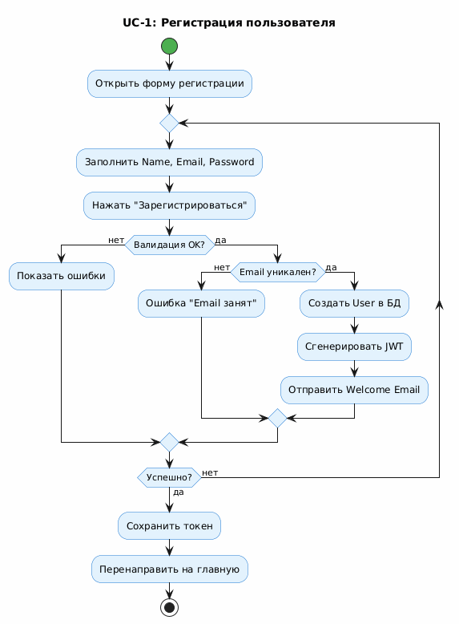
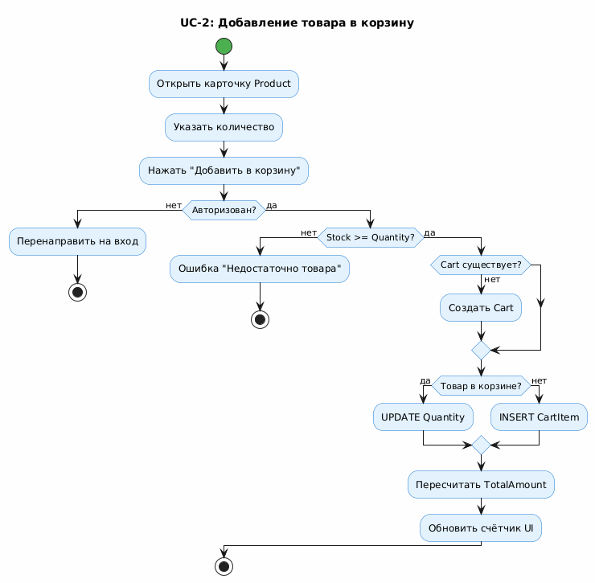
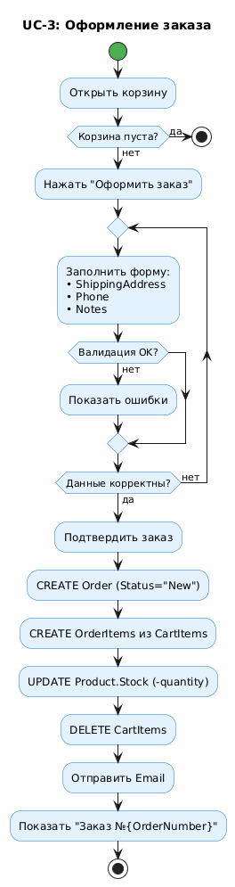
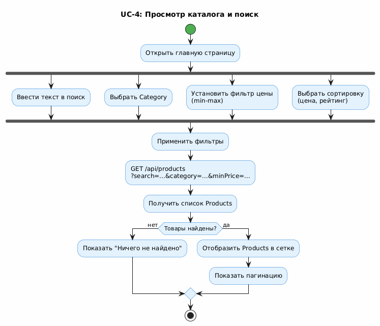
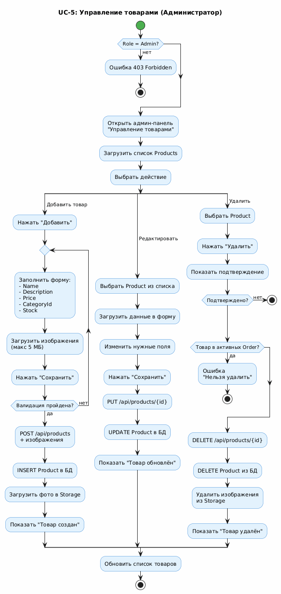

# Activity Diagrams – Online Store

Данный раздел содержит диаграммы активности (Activity Diagrams) для пяти ключевых сценариев использования системы Online Store.

---

## UC-1: Регистрация пользователя

**Описание:**  
Диаграмма отображает процесс регистрации нового пользователя в системе. Включает валидацию данных, проверку уникальности email, создание записи User в базе данных с хешированием пароля (bcrypt), генерацию JWT токена и отправку приветственного письма.

**Основные шаги:**
- Открытие формы регистрации
- Заполнение полей (Name, Email, Password, Confirm Password)
- Валидация на клиенте и сервере
- Проверка уникальности email
- Создание User с ролью "Customer"
- Генерация JWT токена
- Сохранение токена в LocalStorage
- Автоматический вход в систему

---

## UC-2: Добавление товара в корзину

**Описание:**  
Диаграмма демонстрирует процесс добавления товара в корзину пользователя. Включает проверку авторизации, проверку доступности товара на складе (Stock), создание или обновление CartItem, пересчёт общей суммы корзины (Cart.TotalAmount).

**Основные шаги:**
- Открытие карточки товара (Product)
- Указание количества
- Проверка авторизации пользователя
- Проверка Product.IsActive и Product.Stock
- Создание или обновление Cart и CartItem
- Пересчёт Cart.TotalAmount
- Обновление счётчика корзины в UI
- Показ toast-уведомления

---

## UC-3: Оформление заказа

**Описание:**  
Диаграмма отображает процесс оформления заказа пользователем. Включает заполнение формы доставки, проверку доступности товаров, создание Order и OrderItems в одной транзакции, уменьшение остатков на складе (Product.Stock), очистку корзины и отправку email подтверждения.

**Основные шаги:**
- Открытие корзины
- Проверка наличия товаров в корзине
- Заполнение формы доставки (ShippingAddress, Phone, Notes)
- Валидация данных
- Проверка доступности всех товаров (Stock >= Quantity)
- Создание Order со статусом "New"
- Создание OrderItems из CartItems
- Уменьшение Product.Stock
- Удаление CartItems
- Отправка email подтверждения
- Показ страницы с номером заказа

---

## UC-4: Просмотр каталога и поиск

**Описание:**  
Диаграмма демонстрирует процесс просмотра каталога товаров с применением фильтров и сортировки. Включает выбор категории, установку диапазона цен, ввод текста в поиск, применение сортировки и отображение результатов с пагинацией.

**Основные шаги:**
- Открытие главной страницы/каталога
- Применение фильтров (Category, ценовой диапазон)
- Ввод поискового запроса
- Выбор сортировки (по цене, рейтингу, новизне)
- Загрузка списка Products через GET /api/products
- Отображение товаров в сетке
- Показ пагинации
- Обработка случая "Ничего не найдено"

---

## UC-5: Управление товарами (Администратор)

**Описание:**  
Диаграмма отображает процесс управления товарами администратором. Включает три основных действия: добавление нового товара с загрузкой изображений, редактирование существующего товара и удаление товара с проверкой наличия в активных заказах.

**Основные шаги:**
- Проверка роли (Role = "Admin")
- Открытие панели "Управление товарами"
- **Добавление товара:**
  - Заполнение формы (Name, Price, CategoryId, Stock)
  - Загрузка изображений (макс 5 МБ)
  - Валидация данных
  - Создание Product в БД (IsActive = true)
  - Загрузка изображений в файловое хранилище
- **Редактирование товара:**
  - Загрузка данных Product в форму
  - Изменение полей
  - Обновление Product в БД
  - При необходимости обновление изображений
- **Удаление товара:**
  - Проверка наличия в активных заказах
  - При наличии — предложение деактивации (IsActive = false)
  - При отсутствии — удаление Product и изображений

## Примечания

- Все диаграммы созданы с учётом реальной архитектуры проекта (ASP.NET API + Blazor Client)
- Отображены как успешные, так и альтернативные потоки выполнения
- Учтены проверки безопасности (авторизация, валидация)
- Показаны взаимодействия с базой данных и внешними сервисами (Email, File Storage)
