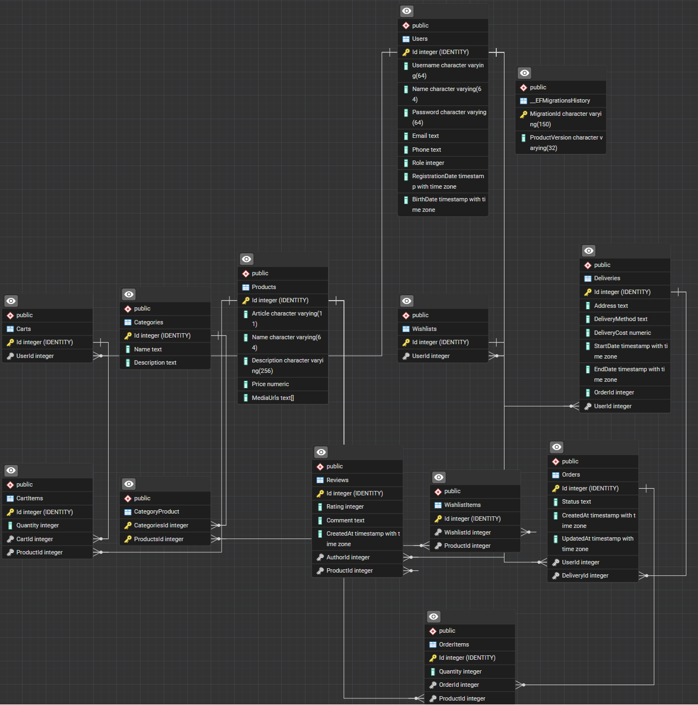

# Диаграмма классов
---

## Содержание
1. [Введение](#intro)
2. [Общая структура](#structure)
3. [Описание классов](#classes)
   - 3.1 [User (Пользователь)](#user)
   - 3.2 [Product (Товар)](#product)
   - 3.3 [Category (Категория)](#category)
   - 3.4 [Cart (Корзина)](#cart)
   - 3.5 [CartItem (Элемент корзины)](#cartitem)
   - 3.6 [Order (Заказ)](#order)
   - 3.7 [OrderItem (Элемент заказа)](#orderitem)
   - 3.8 [Delivery (Доставка)](#delivery)
   - 3.9 [Review (Отзыв)](#review)
   - 3.10 [Wishlist (Список желаний)](#wishlist)
   - 3.11 [WishlistItem (Элемент списка желаний)](#wishlistitem)
4. [Связи между классами](#relationships)
5. [Диаграмма классов](#diagram)

<a name="intro"/>

## 1. Введение

Данный документ описывает структуру классов (моделей) системы **Online Store**, реализованных на языке C# с использованием Entity Framework Core. Диаграмма классов представляет доменную модель приложения, отражающую основные бизнес-сущности, их атрибуты и взаимосвязи.

Все классы находятся в папке `Models` и представляют собой POCO (Plain Old CLR Objects) классы, используемые для отображения данных в базе данных через ORM Entity Framework Core.

<a name="structure"/>

## 2. Общая структура

Система состоит из 11 основных классов-моделей, которые можно разделить на следующие группы:

**Управление пользователями:**
- `User` — информация о пользователях системы

**Управление товарами:**
- `Product` — информация о товарах
- `Category` — категории товаров
- `Review` — отзывы пользователей о товарах

**Управление корзиной:**
- `Cart` — корзины пользователей
- `CartItem` — товары в корзине

**Управление заказами:**
- `Order` — заказы пользователей
- `OrderItem` — товары в заказе
- `Delivery` — информация о доставке заказа

**Управление списком желаний:**
- `Wishlist` — списки желаний пользователей
- `WishlistItem` — товары в списке желаний

<a name="classes"/>

## 3. Описание классов

<a name="user"/>

### 3.1 User (Пользователь)

**Назначение:** Класс представляет пользователя системы — зарегистрированного покупателя или администратора.

**Атрибуты:**
| Атрибут | Тип | Описание |
|:---|:---|:---|
| `Id` | `int` | Уникальный идентификатор пользователя (Primary Key) |
| `Name` | `string` | Имя пользователя |
| `Email` | `string` | Электронная почта (уникальная, используется для входа) |
| `PasswordHash` | `string` | Хеш пароля (bcrypt/PBKDF2) |
| `Phone` | `string?` | Номер телефона (опционально) |
| `Address` | `string?` | Адрес доставки по умолчанию (опционально) |
| `Role` | `string` | Роль пользователя ("Customer", "Admin") |
| `IsBlocked` | `bool` | Флаг блокировки учётной записи |
| `CreatedAt` | `DateTime` | Дата и время регистрации |
| `UpdatedAt` | `DateTime?` | Дата и время последнего обновления профиля |

**Связи:**
- Один пользователь может иметь одну корзину (`Cart`) — связь 1:1
- Один пользователь может иметь один список желаний (`Wishlist`) — связь 1:1
- Один пользователь может создать множество заказов (`Order`) — связь 1:N
- Один пользователь может оставить множество отзывов (`Review`) — связь 1:N

**Методы (потенциальные):**
- Валидация email при регистрации
- Проверка корректности пароля
- Изменение роли (только для администраторов)

<a name="product"/>

### 3.2 Product (Товар)

**Назначение:** Класс представляет товар в каталоге интернет-магазина.

**Атрибуты:**
| Атрибут | Тип | Описание |
|:---|:---|:---|
| `Id` | `int` | Уникальный идентификатор товара (Primary Key) |
| `Name` | `string` | Название товара |
| `Description` | `string` | Подробное описание товара |
| `Price` | `decimal` | Цена товара |
| `DiscountPrice` | `decimal?` | Цена со скидкой (опционально) |
| `Stock` | `int` | Количество товара на складе |
| `Brand` | `string?` | Бренд/производитель товара |
| `ImageUrl` | `string?` | URL изображения товара (основное фото) |
| `CategoryId` | `int` | Внешний ключ на категорию |
| `IsActive` | `bool` | Флаг активности товара (отображается ли в каталоге) |
| `CreatedAt` | `DateTime` | Дата добавления товара |
| `UpdatedAt` | `DateTime?` | Дата последнего обновления |
| `Rating` | `double?` | Средний рейтинг товара (рассчитывается из отзывов) |
| `ReviewCount` | `int` | Количество отзывов |

**Связи:**
- Товар принадлежит одной категории (`Category`) — связь N:1
- Товар может быть добавлен в множество корзин через `CartItem` — связь N:M
- Товар может быть в множестве заказов через `OrderItem` — связь N:M
- Товар может иметь множество отзывов (`Review`) — связь 1:N
- Товар может быть добавлен в множество списков желаний через `WishlistItem` — связь N:M

**Методы (потенциальные):**
- Проверка наличия на складе
- Расчёт цены с учётом скидки
- Обновление рейтинга на основе отзывов
- Уменьшение остатка при оформлении заказа

<a name="category"/>

### 3.3 Category (Категория)

**Назначение:** Класс представляет категорию товаров для организации каталога.

**Атрибуты:**
| Атрибут | Тип | Описание |
|:---|:---|:---|
| `Id` | `int` | Уникальный идентификатор категории (Primary Key) |
| `Name` | `string` | Название категории |
| `Description` | `string?` | Описание категории (опционально) |
| `ParentCategoryId` | `int?` | Внешний ключ на родительскую категорию (для иерархии) |
| `IconUrl` | `string?` | URL иконки категории |
| `DisplayOrder` | `int` | Порядок отображения в интерфейсе |
| `IsActive` | `bool` | Флаг активности категории |

**Связи:**
- Категория может содержать множество товаров (`Product`) — связь 1:N
- Категория может иметь родительскую категорию (`Category`) — связь N:1 (самосвязь)
- Категория может иметь множество подкатегорий (`Category`) — связь 1:N (самосвязь)

**Методы (потенциальные):**
- Получение всех подкатегорий
- Получение всех товаров в категории и подкатегориях
- Проверка иерархии (предотвращение циклических ссылок)

<a name="cart"/>

### 3.4 Cart (Корзина)

**Назначение:** Класс представляет корзину покупок пользователя.

**Атрибуты:**
| Атрибут | Тип | Описание |
|:---|:---|:---|
| `Id` | `int` | Уникальный идентификатор корзины (Primary Key) |
| `UserId` | `int` | Внешний ключ на пользователя |
| `CreatedAt` | `DateTime` | Дата создания корзины |
| `UpdatedAt` | `DateTime?` | Дата последнего обновления |
| `TotalAmount` | `decimal` | Общая стоимость товаров в корзине |

**Связи:**
- Корзина принадлежит одному пользователю (`User`) — связь 1:1
- Корзина содержит множество элементов (`CartItem`) — связь 1:N

**Методы (потенциальные):**
- Расчёт общей стоимости корзины
- Очистка корзины после оформления заказа
- Проверка наличия товаров на складе перед оформлением

<a name="cartitem"/>

### 3.5 CartItem (Элемент корзины)

**Назначение:** Класс представляет отдельный товар в корзине пользователя.

**Атрибуты:**
| Атрибут | Тип | Описание |
|:---|:---|:---|
| `Id` | `int` | Уникальный идентификатор элемента (Primary Key) |
| `CartId` | `int` | Внешний ключ на корзину |
| `ProductId` | `int` | Внешний ключ на товар |
| `Quantity` | `int` | Количество товара |
| `Price` | `decimal` | Цена товара на момент добавления в корзину |
| `AddedAt` | `DateTime` | Дата и время добавления товара в корзину |

**Связи:**
- Элемент принадлежит одной корзине (`Cart`) — связь N:1
- Элемент ссылается на один товар (`Product`) — связь N:1

**Методы (потенциальные):**
- Расчёт стоимости элемента (цена × количество)
- Обновление количества товара
- Валидация количества (не превышает остаток на складе)

<a name="order"/>

### 3.6 Order (Заказ)

**Назначение:** Класс представляет заказ, оформленный пользователем.

**Атрибуты:**
| Атрибут | Тип | Описание |
|:---|:---|:---|
| `Id` | `int` | Уникальный идентификатор заказа (Primary Key) |
| `UserId` | `int` | Внешний ключ на пользователя |
| `OrderNumber` | `string` | Уникальный номер заказа (генерируется системой) |
| `Status` | `string` | Статус заказа ("New", "Processing", "Shipped", "Delivered", "Cancelled") |
| `TotalAmount` | `decimal` | Общая стоимость заказа |
| `ShippingAddress` | `string` | Адрес доставки |
| `Phone` | `string` | Контактный телефон |
| `PaymentMethod` | `string?` | Способ оплаты (опционально) |
| `PaymentStatus` | `string` | Статус оплаты ("Pending", "Paid", "Refunded") |
| `Notes` | `string?` | Комментарии к заказу |
| `CreatedAt` | `DateTime` | Дата и время создания заказа |
| `UpdatedAt` | `DateTime?` | Дата последнего обновления статуса |

**Связи:**
- Заказ принадлежит одному пользователю (`User`) — связь N:1
- Заказ содержит множество элементов (`OrderItem`) — связь 1:N
- Заказ может иметь одну доставку (`Delivery`) — связь 1:1

**Методы (потенциальные):**
- Генерация уникального номера заказа
- Изменение статуса заказа с отправкой уведомления
- Расчёт общей стоимости на основе элементов заказа
- Отмена заказа (возврат товаров на склад)

<a name="orderitem"/>

### 3.7 OrderItem (Элемент заказа)

**Назначение:** Класс представляет отдельный товар в составе заказа.

**Атрибуты:**
| Атрибут | Тип | Описание |
|:---|:---|:---|
| `Id` | `int` | Уникальный идентификатор элемента (Primary Key) |
| `OrderId` | `int` | Внешний ключ на заказ |
| `ProductId` | `int` | Внешний ключ на товар |
| `Quantity` | `int` | Количество товара |
| `Price` | `decimal` | Цена товара на момент оформления заказа |
| `Discount` | `decimal?` | Размер скидки (если применялась) |
| `TotalPrice` | `decimal` | Общая стоимость элемента (цена × количество - скидка) |

**Связи:**
- Элемент принадлежит одному заказу (`Order`) — связь N:1
- Элемент ссылается на один товар (`Product`) — связь N:1

**Методы (потенциальные):**
- Расчёт общей стоимости элемента с учётом скидки
- Фиксация цены товара на момент заказа (не изменяется при изменении цены в каталоге)

<a name="delivery"/>

### 3.8 Delivery (Доставка)

**Назначение:** Класс представляет информацию о доставке заказа.

**Атрибуты:**
| Атрибут | Тип | Описание |
|:---|:---|:---|
| `Id` | `int` | Уникальный идентификатор доставки (Primary Key) |
| `OrderId` | `int` | Внешний ключ на заказ |
| `DeliveryMethod` | `string` | Способ доставки ("Courier", "Pickup", "Post") |
| `TrackingNumber` | `string?` | Трек-номер для отслеживания |
| `DeliveryCompany` | `string?` | Название службы доставки |
| `EstimatedDeliveryDate` | `DateTime?` | Ожидаемая дата доставки |
| `ActualDeliveryDate` | `DateTime?` | Фактическая дата доставки |
| `DeliveryCost` | `decimal` | Стоимость доставки |
| `Status` | `string` | Статус доставки ("Pending", "InTransit", "Delivered") |
| `RecipientName` | `string` | Имя получателя |
| `RecipientPhone` | `string` | Телефон получателя |
| `Notes` | `string?` | Примечания к доставке |

**Связи:**
- Доставка связана с одним заказом (`Order`) — связь 1:1

**Методы (потенциальные):**
- Обновление статуса доставки
- Расчёт стоимости доставки в зависимости от веса и адреса
- Генерация трек-номера

<a name="review"/>

### 3.9 Review (Отзыв)

**Назначение:** Класс представляет отзыв пользователя о товаре.

**Атрибуты:**
| Атрибут | Тип | Описание |
|:---|:---|:---|
| `Id` | `int` | Уникальный идентификатор отзыва (Primary Key) |
| `ProductId` | `int` | Внешний ключ на товар |
| `UserId` | `int` | Внешний ключ на пользователя |
| `Rating` | `int` | Оценка товара (1-5 звёзд) |
| `Title` | `string?` | Заголовок отзыва |
| `Comment` | `string` | Текст отзыва |
| `IsVerifiedPurchase` | `bool` | Флаг подтверждённой покупки |
| `IsApproved` | `bool` | Флаг модерации (одобрен ли отзыв) |
| `CreatedAt` | `DateTime` | Дата создания отзыва |
| `UpdatedAt` | `DateTime?` | Дата последнего редактирования |

**Связи:**
- Отзыв относится к одному товару (`Product`) — связь N:1
- Отзыв оставлен одним пользователем (`User`) — связь N:1

**Методы (потенциальные):**
- Валидация рейтинга (1-5)
- Проверка, что пользователь покупал данный товар
- Обновление среднего рейтинга товара после добавления/изменения отзыва

<a name="wishlist"/>

### 3.10 Wishlist (Список желаний)

**Назначение:** Класс представляет список желаний (избранное) пользователя.

**Атрибуты:**
| Атрибут | Тип | Описание |
|:---|:---|:---|
| `Id` | `int` | Уникальный идентификатор списка желаний (Primary Key) |
| `UserId` | `int` | Внешний ключ на пользователя |
| `Name` | `string` | Название списка желаний (например, "Мои желания", "Подарки") |
| `IsDefault` | `bool` | Флаг списка по умолчанию |
| `CreatedAt` | `DateTime` | Дата создания списка |
| `UpdatedAt` | `DateTime?` | Дата последнего обновления |

**Связи:**
- Список желаний принадлежит одному пользователю (`User`) — связь 1:1 или N:1 (если пользователь может иметь несколько списков)
- Список содержит множество элементов (`WishlistItem`) — связь 1:N

**Методы (потенциальные):**
- Добавление товаров в список
- Перемещение товаров из списка желаний в корзину
- Удаление списка желаний

<a name="wishlistitem"/>

### 3.11 WishlistItem (Элемент списка желаний)

**Назначение:** Класс представляет отдельный товар в списке желаний пользователя.

**Атрибуты:**
| Атрибут | Тип | Описание |
|:---|:---|:---|
| `Id` | `int` | Уникальный идентификатор элемента (Primary Key) |
| `WishlistId` | `int` | Внешний ключ на список желаний |
| `ProductId` | `int` | Внешний ключ на товар |
| `AddedAt` | `DateTime` | Дата и время добавления товара в список |
| `Priority` | `int?` | Приоритет товара в списке (опционально) |
| `Notes` | `string?` | Примечания к товару |

**Связи:**
- Элемент принадлежит одному списку желаний (`Wishlist`) — связь N:1
- Элемент ссылается на один товар (`Product`) — связь N:1

**Методы (потенциальные):**
- Перемещение товара в корзину
- Изменение приоритета товара в списке

<a name="relationships"/>

## 4. Связи между классами

### Основные типы связей

**1. User ↔ Cart (1:1)**
- Один пользователь имеет одну корзину
- Связь через внешний ключ `Cart.UserId` → `User.Id`

**2. User ↔ Wishlist (1:1 или 1:N)**
- Один пользователь имеет один или несколько списков желаний
- Связь через внешний ключ `Wishlist.UserId` → `User.Id`

**3. User ↔ Order (1:N)**
- Один пользователь может создать множество заказов
- Связь через внешний ключ `Order.UserId` → `User.Id`

**4. User ↔ Review (1:N)**
- Один пользователь может оставить множество отзывов
- Связь через внешний ключ `Review.UserId` → `User.Id`

**5. Category ↔ Product (1:N)**
- Одна категория содержит множество товаров
- Связь через внешний ключ `Product.CategoryId` → `Category.Id`

**6. Category ↔ Category (самосвязь, N:1)**
- Категория может иметь родительскую категорию (иерархия)
- Связь через внешний ключ `Category.ParentCategoryId` → `Category.Id`

**7. Product ↔ CartItem (1:N)**
- Один товар может быть в множестве корзин через CartItem
- Связь через внешний ключ `CartItem.ProductId` → `Product.Id`

**8. Cart ↔ CartItem (1:N)**
- Одна корзина содержит множество элементов
- Связь через внешний ключ `CartItem.CartId` → `Cart.Id`

**9. Product ↔ OrderItem (1:N)**
- Один товар может быть в множестве заказов через OrderItem
- Связь через внешний ключ `OrderItem.ProductId` → `Product.Id`

**10. Order ↔ OrderItem (1:N)**
- Один заказ содержит множество элементов
- Связь через внешний ключ `OrderItem.OrderId` → `Order.Id`

**11. Order ↔ Delivery (1:1)**
- Один заказ имеет одну доставку
- Связь через внешний ключ `Delivery.OrderId` → `Order.Id`

**12. Product ↔ Review (1:N)**
- Один товар может иметь множество отзывов
- Связь через внешний ключ `Review.ProductId` → `Product.Id`

**13. Product ↔ WishlistItem (1:N)**
- Один товар может быть в множестве списков желаний через WishlistItem
- Связь через внешний ключ `WishlistItem.ProductId` → `Product.Id`

**14. Wishlist ↔ WishlistItem (1:N)**
- Один список желаний содержит множество элементов
- Связь через внешний ключ `WishlistItem.WishlistId` → `Wishlist.Id`

### Таблица связей

| Класс 1 | Связь | Класс 2 | Тип связи | Описание |
|:---|:---|:---|:---|:---|
| User | has one | Cart | 1:1 | У пользователя есть одна корзина |
| User | has one/many | Wishlist | 1:1 / 1:N | У пользователя есть список(ки) желаний |
| User | creates many | Order | 1:N | Пользователь создаёт множество заказов |
| User | writes many | Review | 1:N | Пользователь оставляет множество отзывов |
| Category | contains many | Product | 1:N | Категория содержит множество товаров |
| Category | has parent | Category | N:1 | Категория может иметь родительскую категорию |
| Product | belongs to | Category | N:1 | Товар принадлежит одной категории |
| Product | added to many | CartItem | 1:N | Товар добавляется в множество корзин |
| Product | added to many | OrderItem | 1:N | Товар добавляется в множество заказов |
| Product | has many | Review | 1:N | Товар имеет множество отзывов |
| Product | added to many | WishlistItem | 1:N | Товар добавляется в множество списков желаний |
| Cart | belongs to | User | N:1 | Корзина принадлежит пользователю |
| Cart | contains many | CartItem | 1:N | Корзина содержит множество элементов |
| CartItem | belongs to | Cart | N:1 | Элемент принадлежит корзине |
| CartItem | references | Product | N:1 | Элемент ссылается на товар |
| Order | belongs to | User | N:1 | Заказ принадлежит пользователю |
| Order | contains many | OrderItem | 1:N | Заказ содержит множество элементов |
| Order | has one | Delivery | 1:1 | Заказ имеет одну доставку |
| OrderItem | belongs to | Order | N:1 | Элемент принадлежит заказу |
| OrderItem | references | Product | N:1 | Элемент ссылается на товар |
| Delivery | belongs to | Order | 1:1 | Доставка связана с заказом |
| Review | belongs to | Product | N:1 | Отзыв относится к товару |
| Review | written by | User | N:1 | Отзыв написан пользователем |
| Wishlist | belongs to | User | N:1 | Список желаний принадлежит пользователю |
| Wishlist | contains many | WishlistItem | 1:N | Список содержит множество элементов |
| WishlistItem | belongs to | Wishlist | N:1 | Элемент принадлежит списку |
| WishlistItem | references | Product | N:1 | Элемент ссылается на товар |

<a name="diagram"/>

## 5. Диаграмма классов

Диаграмма визуально отображает:
- **Классы** с их атрибутами и методами
- **Связи** между классами (ассоциации, агрегации, композиции)
- **Кардинальность** связей (1:1, 1:N, N:M)
- **Направление** зависимостей

### Легенда диаграммы

**Обозначения связей:**
- `——>` — ассоциация (один класс использует другой)
- `◇——` — агрегация (слабая связь, объект может существовать независимо)
- `◆——` — композиция (сильная связь, объект не может существовать без родителя)
- `1, *, 0..1, 1..*` — кардинальность связи

**Примеры композиции в системе:**
- `Order ◆—— OrderItem` — элементы заказа не могут существовать без заказа
- `Cart ◆—— CartItem` — элементы корзины не могут существовать без корзины
- `Wishlist ◆—— WishlistItem` — элементы списка желаний не могут существовать без списка

**Примеры ассоциации:**
- `User ——> Order` — пользователь создаёт заказы, но заказ хранит ссылку на пользователя
- `Product ——> Category` — товар принадлежит категории

---

## Заключение

Данная диаграмма классов отражает полную доменную модель системы **Online Store**, включающую:
- Управление пользователями с ролями и блокировкой
- Каталог товаров с категориями и отзывами
- Корзину покупок с возможностью сохранения между сессиями
- Систему заказов с отслеживанием статуса и доставкой
- Список желаний для сохранения избранных товаров

Все классы спроектированы с учётом принципов реляционных баз данных и поддерживают работу через Entity Framework Core с использованием миграций.
