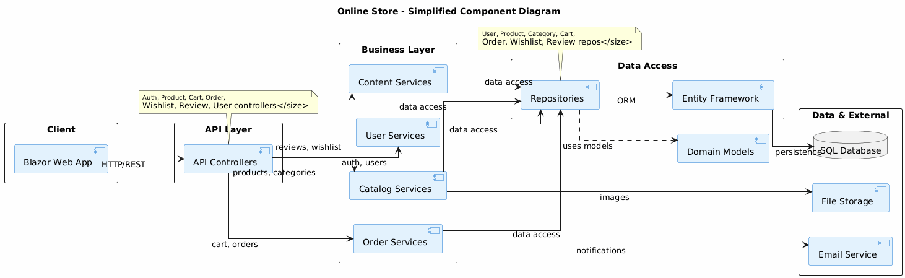

# Component Diagram – Online Store

Данный раздел содержит диаграмму компонентов (Component Diagram) системы Online Store, показывающую архитектурную структуру приложения и взаимосвязи между компонентами.

---

## Диаграмма компонентов

---

## Описание архитектуры

Система Online Store построена по многоуровневой архитектуре с чётким разделением ответственности:

### **1. Presentation Layer (Уровень представления)**

Отвечает за взаимодействие с пользователем и обработку HTTP-запросов.

**Компоненты:**
- **Blazor WebAssembly UI** — клиентское приложение, выполняемое в браузере пользователя. Взаимодействует с API через HTTP/JSON запросы.
- **API Controllers** — набор контроллеров ASP.NET Core, принимающих HTTP-запросы и возвращающих JSON-ответы:
  - `AuthController` — регистрация, вход, управление токенами
  - `ProductController` — получение списка товаров, деталей товара
  - `CartController` — управление корзиной (добавление, обновление, удаление)
  - `OrderController` — создание и просмотр заказов
  - `WishlistController` — управление списком желаний
  - `ReviewController` — создание и модерация отзывов
  - `UserController` — управление профилем пользователя

---

### **2. Application & Business Layer (Уровень бизнес-логики)**

Содержит сервисы, реализующие бизнес-логику приложения.

**Подсистема "Auth & Users":**
- **AuthService** — аутентификация, генерация JWT токенов, хеширование паролей
- **UserService** — управление пользователями, изменение ролей, блокировка

**Подсистема "Catalog":**
- **ProductService** — управление товарами, поиск, фильтрация, загрузка изображений
- **CategoryService** — управление категориями товаров

**Подсистема "Cart & Orders":**
- **CartService** — управление корзиной, пересчёт общей суммы
- **OrderService** — создание заказов, управление статусами, транзакционная обработка
- **DeliveryService** — управление информацией о доставке

**Подсистема "Wishlist & Reviews":**
- **WishlistService** — управление списком желаний
- **ReviewService** — создание отзывов, модерация, расчёт рейтингов

---

### **3. Data Access Layer (Уровень доступа к данным)**

Обеспечивает взаимодействие с базой данных через паттерн Repository.

**Repositories:**
- `UserRepository` → работа с таблицей Users
- `ProductRepository` → работа с таблицей Products
- `CategoryRepository` → работа с таблицей Categories
- `CartRepository` → работа с таблицами Cart, CartItems
- `OrderRepository` → работа с таблицами Orders, OrderItems
- `WishlistRepository` → работа с таблицами Wishlist, WishlistItems
- `ReviewRepository` → работа с таблицей Reviews
- `DeliveryRepository` → работа с таблицей Deliveries

**DbContext (Entity Framework Core):**
- Центральный компонент для работы с БД
- Управление подключениями, транзакциями, миграциями
- LINQ-запросы к базе данных

**Database:**
- Реляционная база данных (SQL Server / PostgreSQL)
- Хранит все данные системы

---

### **4. External Systems (Внешние системы)**

Интеграция с внешними сервисами для расширения функционала.

**Компоненты:**
- **Email Service** — отправка уведомлений (регистрация, подтверждение заказа, изменение статуса)
  - Реализации: SMTP, SendGrid, MailChimp
- **File Storage** — хранение изображений товаров
  - Реализации: Azure Blob Storage, AWS S3, локальное хранилище

---

### **5. Domain Models (Модели предметной области)**

Представляют бизнес-сущности системы.

**Основные модели:**
- **User** — пользователь системы (покупатель или администратор)
- **Product** — товар в каталоге
- **Category** — категория товаров
- **Cart** — корзина пользователя
- **CartItem** — элемент корзины (товар + количество)
- **Order** — заказ пользователя
- **OrderItem** — элемент заказа (товар + количество + фиксированная цена)
- **Delivery** — информация о доставке
- **Wishlist** — список желаний пользователя
- **WishlistItem** — элемент списка желаний
- **Review** — отзыв о товаре

---

## Потоки данных

### **1. Аутентификация пользователя:**
