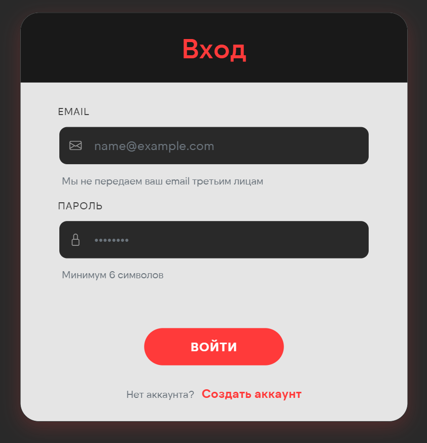
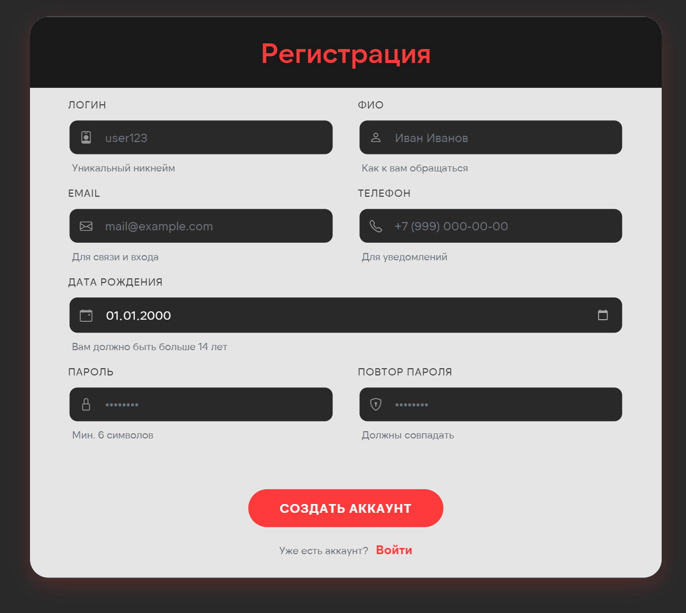
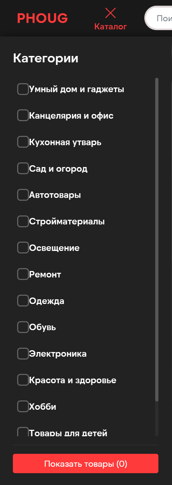

# Mockups – Online Store

Макеты пользовательского интерфейса системы Online Store.

---

## 1. Главная страница

**Основные элементы:**
- Шапка с логотипом, поиском, корзиной и профилем
- Промо-баннер с акциями
- Сетка категорий товаров
- Список популярных товаров с кнопками "В корзину"

---

## 2. Страница входа

**Основные элементы:**
- Форма входа (Email, Пароль)
- Кнопка "Войти"
- Ссылки "Забыли пароль?" и "Зарегистрироваться"

---

## 3. Страница регистрации

**Основные элементы:**
- Форма регистрации (Имя, Email, Пароль, Подтверждение пароля)
- Индикатор сложности пароля
- Чекбокс согласия с условиями
- Кнопка "Зарегистрироваться"

---

## 4. Каталог товаров

**Основные элементы:**
- Боковая панель с фильтрами (категории, цена, бренды)
- Сортировка товаров
- Сетка карточек товаров
- Пагинация
