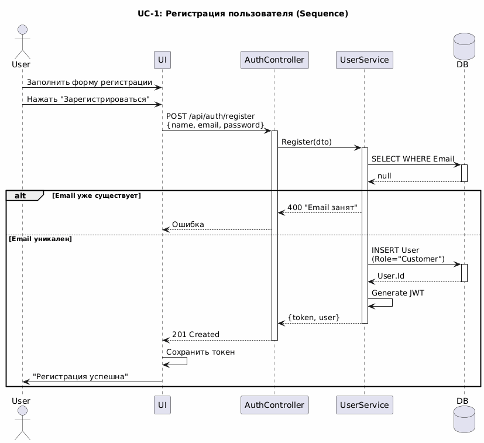
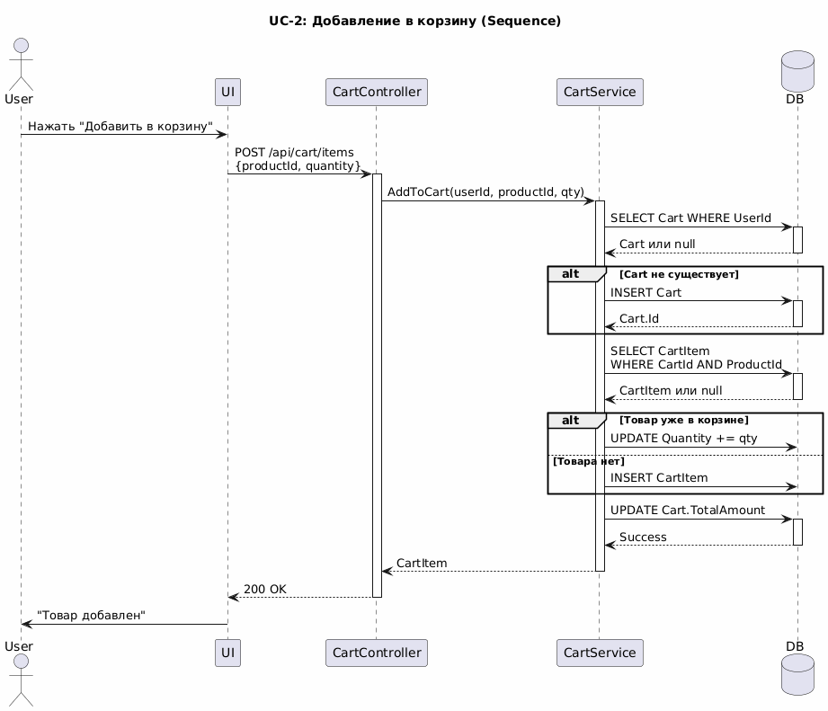
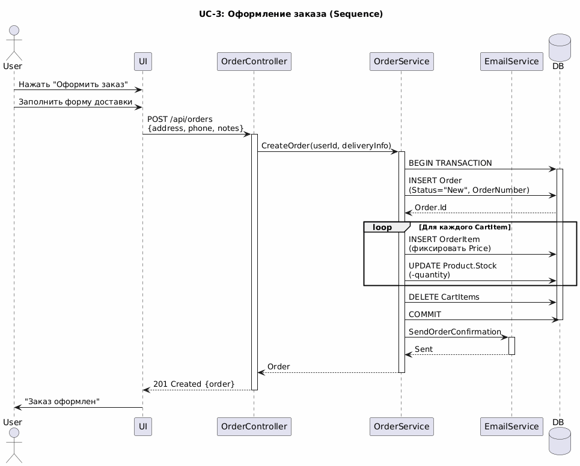
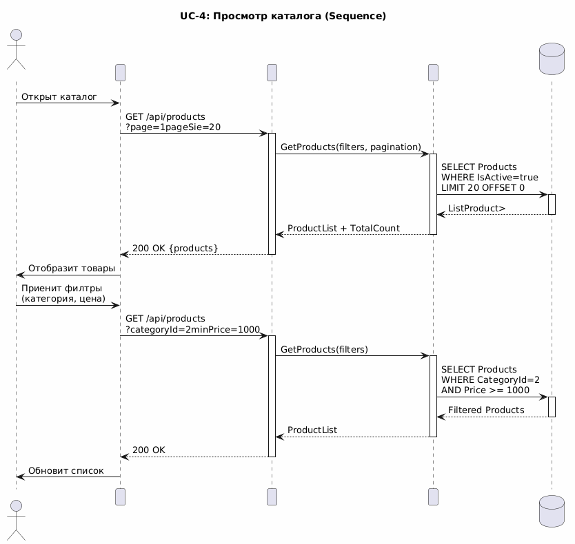
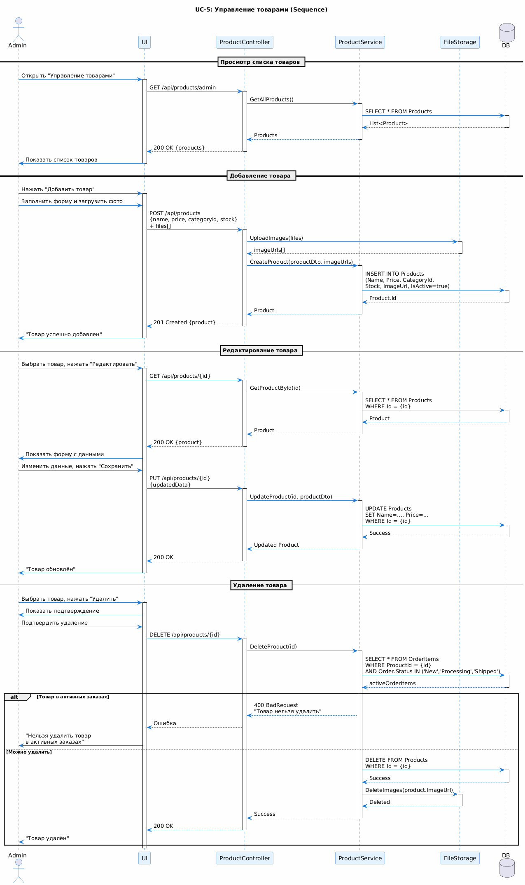

# Sequence Diagrams – Online Store

Данный раздел содержит диаграммы последовательности (Sequence Diagrams) для пяти ключевых сценариев использования системы Online Store. Диаграммы показывают взаимодействие между компонентами системы во времени.

---

## UC-1: Регистрация пользователя

**Описание:**  
Диаграмма демонстрирует последовательность взаимодействия между Blazor UI, AuthController, UserService и базой данных при регистрации нового пользователя.

**Участники:**
- User (Пользователь)
- Blazor UI
- AuthController
- UserService
- EmailService
- Database

**Основной поток:**
1. Пользователь заполняет форму регистрации
2. UI отправляет POST /api/auth/register с данными
3. AuthController передаёт запрос в UserService
4. UserService проверяет уникальность email в БД
5. UserService хеширует пароль (bcrypt)
6. Создаётся запись User в БД
7. Генерируется JWT токен
8. Асинхронно отправляется приветственное письмо
9. Токен возвращается клиенту
10. Токен сохраняется в LocalStorage

**Альтернативные потоки:**
- Email уже существует → 400 Bad Request
- Ошибка валидации → 400 с описанием ошибок

---

## UC-2: Добавление товара в корзину

**Описание:**  
Диаграмма показывает взаимодействие компонентов при добавлении товара в корзину авторизованного пользователя.

**Участники:**
- User (Пользователь)
- Blazor UI
- CartController
- CartService
- ProductService
- Database

**Основной поток:**
1. Пользователь нажимает "Добавить в корзину"
2. UI отправляет POST /api/cart/items с productId и quantity
3. CartController извлекает UserId из JWT токена
4. CartController запрашивает Product через ProductService
5. ProductService проверяет Product.IsActive и Product.Stock
6. CartService ищет или создаёт Cart для пользователя
7. CartService проверяет наличие CartItem с данным ProductId
8. При наличии — обновляет Quantity, при отсутствии — создаёт новый CartItem
9. CartService пересчитывает Cart.TotalAmount
10. Обновлённые данные возвращаются клиенту
11. UI обновляет счётчик корзины

**Альтернативные потоки:**
- Stock недостаточно → 400 "Недостаточно товара на складе"
- Product неактивен → 400 "Товар снят с продажи"

---

## UC-3: Оформление заказа

**Описание:**  
Диаграмма демонстрирует процесс создания заказа с транзакционной обработкой и взаимодействием с внешним email-сервисом.

**Участники:**
- User (Пользователь)
- Blazor UI
- OrderController
- OrderService
- CartService
- EmailService
- Database

**Основной поток:**
1. Пользователь заполняет форму доставки и подтверждает заказ
2. UI отправляет POST /api/orders с данными доставки
3. OrderController передаёт запрос в OrderService
4. OrderService загружает Cart и CartItems пользователя
5. OrderService проверяет доступность всех товаров (Stock >= Quantity)
6. Начинается транзакция в БД:
   - Создаётся Order со статусом "New" и уникальным OrderNumber
   - Для каждого CartItem создаётся OrderItem с фиксированной ценой
   - Уменьшается Product.Stock для каждого товара
   - Создаётся запись Delivery
   - Удаляются все CartItems
7. Транзакция фиксируется (COMMIT)
8. Асинхронно отправляется email подтверждение
9. Данные заказа возвращаются клиенту
10. UI показывает страницу "Заказ оформлен" с номером заказа

**Альтернативные потоки:**
- Корзина пуста → 400 "Корзина пуста"
- Товара недостаточно → ROLLBACK транзакции, 400 с указанием товара
- Ошибка при создании заказа → ROLLBACK, 500 Internal Server Error

---

## UC-4: Просмотр каталога и поиск

**Описание:**  
Диаграмма показывает процесс загрузки и фильтрации товаров в каталоге.

**Участники:**
- User (Пользователь)
- Blazor UI
- ProductController
- ProductService
- Database

**Основной поток:**
1. Пользователь открывает каталог
2. UI отправляет GET /api/products с параметрами (page, pageSize)
3. ProductController передаёт запрос в ProductService
4. ProductService выполняет SELECT с условием IsActive = true и пагинацией
5. Возвращается список Products и TotalCount
6. UI отображает товары в сетке
7. Пользователь применяет фильтры (категория, цена)
8. UI отправляет GET /api/products с параметрами фильтрации
9. ProductService выполняет SELECT с условиями фильтрации
10. Отфильтрованный список возвращается клиенту
11. UI обновляет отображение

**Альтернативные потоки:**
- Товары не найдены → возвращается пустой список с TotalCount = 0
- Ошибка БД → 500 Internal Server Error

---

## UC-5: Управление товарами (Администратор)

**Описание:**  
Диаграмма демонстрирует процесс добавления, редактирования и удаления товаров администратором с загрузкой изображений в файловое хранилище.

**Участники:**
- Admin (Администратор)
- Blazor UI
- ProductController
- ProductService
- FileStorage
- Database

**Основной поток (Добавление товара):**
1. Администратор открывает панель управления товарами
2. UI запрашивает список всех товаров (включая неактивные)
3. Администратор нажимает "Добавить товар" и заполняет форму
4. UI отправляет POST /api/products с данными + multipart/form-data (изображения)
5. ProductController загружает изображения в FileStorage
6. FileStorage возвращает URLs изображений
7. ProductController передаёт данные в ProductService
8. ProductService создаёт запись Product в БД
9. Данные нового товара возвращаются клиенту
10. UI показывает уведомление "Товар создан"

**Основной поток (Редактирование):**
1. Администратор выбирает товар и нажимает "Редактировать"
2. UI загружает данные Product через GET /api/products/{id}
3. Администратор вносит изменения и сохраняет
4. UI отправляет PUT /api/products/{id}
5. ProductService обновляет Product в БД
6. При замене изображений старые удаляются, новые загружаются
7. UI показывает уведомление "Товар обновлён"

**Основной поток (Удаление):**
1. Администратор нажимает "Удалить"
2. UI показывает подтверждение
3. UI отправляет DELETE /api/products/{id}
4. ProductService проверяет наличие товара в активных заказах
5. Если товар используется → 400 "Нельзя удалить товар в активных заказах"
6. Если нет — Product удаляется из БД
7. FileStorage удаляет изображения
8. UI показывает уведомление "Товар удалён"

---

## Технические детали

**Инструмент:** PlantUML  
**Формат:** PNG  
**Нотация:** UML Sequence Diagram

**Используемые элементы:**
- Lifelines (линии жизни участников)
- Activation boxes (прямоугольники активации)
- Synchronous messages (сплошные стрелки)
- Return messages (пунктирные стрелки)
- Alt/Opt frames (альтернативные потоки)
- Loop frames (циклы)
- Par frames (параллельные процессы)

**Условные обозначения:**
- `activate` / `deactivate` — активация участника
- `alt` — альтернативный поток
- `loop` — цикл
- `par` — параллельное выполнение

---

## Примечания

- Все диаграммы показывают реальное взаимодействие между компонентами ASP.NET API
- Отображены как успешные, так и ошибочные сценарии
- Показаны транзакции БД (BEGIN/COMMIT/ROLLBACK)
- Учтены асинхронные операции (email, file upload)
- Соблюдена архитектура: Controller → Service → Repository → Database
