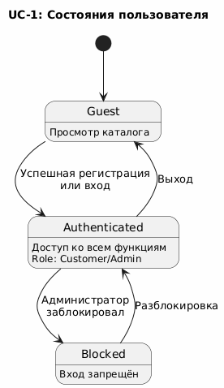
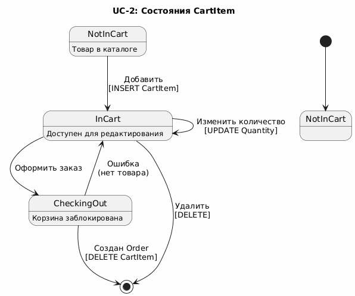
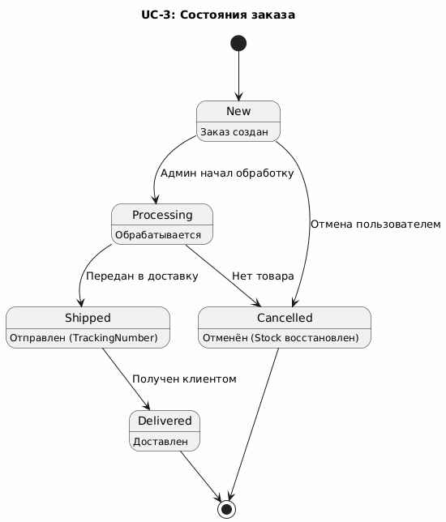
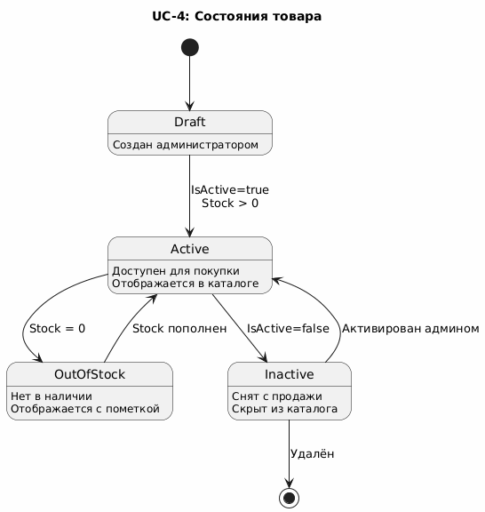
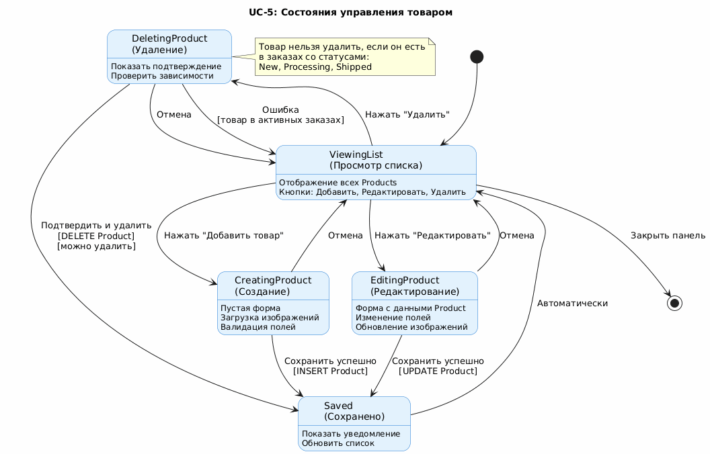

# State Diagrams – Online Store

Данный раздел содержит диаграммы состояний (State Diagrams) для пяти ключевых сущностей системы Online Store. Диаграммы показывают возможные состояния объектов и переходы между ними.

---

## UC-1: Состояния пользователя (User)

**Описание:**  
Диаграмма отображает жизненный цикл пользователя в системе от момента первого входа как гостя до возможной блокировки администратором.

**Состояния:**

### **Guest (Гость)**
- **Описание:** Неавторизованный пользователь
- **Доступ:** Просмотр каталога, поиск товаров
- **Ограничения:** Нет доступа к корзине, заказам, избранному

### **Authenticated (Авторизован)**
- **Описание:** Успешно прошедший регистрацию или вход пользователь
- **Роль:** Customer или Admin
- **Доступ:** Полный функционал в зависимости от роли
- **Действия:** Добавление в корзину, оформление заказов, управление профилем

### **Blocked (Заблокирован)**
- **Описание:** Пользователь, заблокированный администратором (IsBlocked = true)
- **Ограничения:** Вход в систему запрещён (403 Forbidden)
- **Причины блокировки:** Нарушение правил, мошенничество, запрос пользователя

**Переходы:**
- `Guest → Authenticated`: Успешная регистрация или вход
- `Authenticated → Guest`: Выход из системы (logout)
- `Authenticated → Blocked`: Администратор установил IsBlocked = true
- `Blocked → Authenticated`: Администратор разблокировал пользователя

---

## UC-2: Состояния элемента корзины (CartItem)

**Описание:**  
Диаграмма показывает жизненный цикл элемента корзины от добавления товара до создания заказа или удаления.

**Состояния:**

### **NotInCart (Не в корзине)**
- **Описание:** Товар существует в каталоге, но не добавлен в корзину
- **UI:** Кнопка "Добавить в корзину"

### **InCart (В корзине)**
- **Описание:** Товар добавлен в корзину пользователя
- **Атрибуты:** CartItem.Quantity, CartItem.Price (зафиксированная цена)
- **Действия:** Изменение количества, удаление, оформление заказа
- **Особенность:** Price фиксируется на момент добавления и не меняется при изменении цены в Product

### **QuantityUpdating (Обновление количества)**
- **Описание:** Процесс изменения количества товара
- **Проверки:** Quantity > 0, Stock >= Quantity
- **Результат:** Обновление CartItem.Quantity и пересчёт Cart.TotalAmount

### **CheckingOut (Оформление заказа)**
- **Описание:** Корзина заблокирована, идёт создание заказа
- **Проверки:** Проверка доступности всех товаров (Product.Stock)

### **OrderCreated (Заказ создан)**
- **Описание:** CartItem преобразован в OrderItem
- **Действия:** CartItem удаляется, Product.Stock уменьшается

**Переходы:**
- `NotInCart → InCart`: INSERT CartItem или UPDATE Quantity
- `InCart → QuantityUpdating`: Изменение количества
- `QuantityUpdating → InCart`: Успешное обновление
- `QuantityUpdating → Removed`: Quantity = 0
- `InCart → Removed`: Удаление товара из корзины
- `InCart → CheckingOut`: Нажатие "Оформить заказ"
- `CheckingOut → OrderCreated`: Успешное создание Order
- `CheckingOut → InCart`: Ошибка (нет товара на складе)

---

## UC-3: Состояния заказа (Order)

**Описание:**  
Диаграмма отображает жизненный цикл заказа от создания до доставки или отмены.

**Состояния:**

### **New (Новый)**
- **Описание:** Заказ только что создан
- **Действия:** Ожидает обработки администратором
- **Возможные переходы:** В обработку или отмена

### **Processing (Обрабатывается)**
- **Описание:** Заказ принят в работу администратором
- **Действия:** Комплектация товаров, подготовка к отправке
- **Возможные переходы:** Отправка или отмена (при отсутствии товара)

### **Shipped (Отправлен)**
- **Описание:** Заказ передан в службу доставки
- **Атрибуты:** Delivery.TrackingNumber, EstimatedDeliveryDate
- **Действия:** Клиент отслеживает доставку

### **Delivered (Доставлен)**
- **Описание:** Заказ получен клиентом
- **Финальное состояние**
- **Действия:** Клиент может оставить отзыв

### **Cancelled (Отменён)**
- **Описание:** Заказ отменён пользователем или администратором
- **Финальное состояние**
- **Действия:** Product.Stock восстанавливается

**Переходы:**
- `New → Processing`: Администратор начал обработку
- `New → Cancelled`: Отмена пользователем
- `Processing → Shipped`: Передан в доставку
- `Processing → Cancelled`: Нет товара на складе
- `Shipped → Delivered`: Получен клиентом
- `Cancelled → [End]`: Завершение
- `Delivered → [End]`: Завершение

**Примечание:** Из статусов Shipped и Delivered отмена невозможна.

---

## UC-4: Состояния товара (Product)

**Описание:**  
Диаграмма показывает состояния товара в каталоге в зависимости от доступности и активности.

**Состояния:**

### **Draft (Черновик)**
- **Описание:** Товар создан администратором, но не опубликован
- **IsActive:** false
- **Stock:** может быть 0
- **Видимость:** Скрыт из каталога

### **Active (Активный)**
- **Описание:** Товар доступен для покупки
- **IsActive:** true
- **Stock:** > 0
- **Видимость:** Отображается в каталоге

### **OutOfStock (Нет в наличии)**
- **Описание:** Товар активен, но закончился на складе
- **IsActive:** true
- **Stock:** = 0
- **Видимость:** Отображается с пометкой "Нет в наличии"
- **Действия:** Нельзя добавить в корзину

### **Inactive (Неактивный)**
- **Описание:** Товар снят с продажи администратором
- **IsActive:** false
- **Видимость:** Скрыт из каталога
- **Причины:** Устаревший товар, прекращение продаж

**Переходы:**
- `Draft → Active`: IsActive = true AND Stock > 0
- `Active → OutOfStock`: Stock = 0 (после покупок)
- `OutOfStock → Active`: Stock пополнен
- `Active → Inactive`: IsActive = false (деактивация)
- `Inactive → Active`: IsActive = true (активация)
- `Inactive → [End]`: Удаление товара

---

## UC-5: Состояния процесса управления товаром (Admin Workflow)

**Описание:**  
Диаграмма отображает состояния интерфейса администратора при управлении товарами.

**Состояния:**

### **ViewingList (Просмотр списка)**
- **Описание:** Администратор видит список всех товаров
- **Действия:** Выбор товара для редактирования/удаления, добавление нового
- **UI:** Таблица с кнопками "Добавить", "Редактировать", "Удалить"

### **CreatingProduct (Создание товара)**
- **Описание:** Процесс добавления нового товара
- **Форма:** Пустая, ожидает заполнения
- **Проверки:** Валидация полей, загрузка изображений

### **EditingProduct (Редактирование)**
- **Описание:** Процесс изменения существующего товара
- **Форма:** Заполнена текущими данными Product
- **Проверки:** Валидация изменений, обновление изображений

### **DeletingProduct (Удаление)**
- **Описание:** Процесс удаления товара
- **Проверки:** Наличие в активных заказах
- **Подтверждение:** Модальное окно

### **Saved (Сохранено)**
- **Описание:** Временное состояние после успешной операции
- **Действия:** Показ уведомления, обновление списка

**Переходы:**
- `ViewingList → CreatingProduct`: Нажать "Добавить товар"
- `CreatingProduct → Saved`: Сохранить (INSERT Product)
- `CreatingProduct → ViewingList`: Отмена
- `ViewingList → EditingProduct`: Нажать "Редактировать"
- `EditingProduct → Saved`: Сохранить (UPDATE Product)
- `EditingProduct → ViewingList`: Отмена
- `ViewingList → DeletingProduct`: Нажать "Удалить"
- `DeletingProduct → Saved`: Подтвердить (DELETE Product, если можно)
- `DeletingProduct → ViewingList`: Отмена или ошибка (товар в заказах)
- `Saved → ViewingList`: Автоматически после показа уведомления

**Примечание:** Товар нельзя удалить, если он есть в заказах со статусами New, Processing, Shipped.